# TÀI LIỆU PHÂN TÍCH & THIẾT KẾ HỆ THỐNG
# AH PHONE STORE — Hệ thống Thương mại Điện tử bán điện thoại & phụ kiện

**Phiên bản:** 1.0
**Ngày cập nhật:** Tháng 6/2026
**Website:** https://ahphonestore.id.vn
**Nền tảng:** Magento 2.4.8 (backend) + Next.js 16 (frontend) — mô hình Headless Commerce

---

## MỤC LỤC

1. [Mở đầu - Giới thiệu chung](#1-mở-đầu---giới-thiệu-chung)
   - 1.1. [Đặt vấn đề](#11-đặt-vấn-đề)
   - 1.2. [Mục tiêu](#12-mục-tiêu)
   - 1.3. [Phạm vi và đối tượng đặc tả nghiệp vụ](#13-phạm-vi-và-đối-tượng-đặc-tả-nghiệp-vụ)
   - 1.4. [Phương pháp và quy trình đặc tả nghiệp vụ](#14-phương-pháp-và-quy-trình-đặc-tả-nghiệp-vụ)
2. [Phân tích tác nhân và yêu cầu hệ thống](#2-phân-tích-tác-nhân-và-yêu-cầu-hệ-thống)
   - 2.1. [Mô tả tổng quan](#21-mô-tả-tổng-quan)
   - 2.2. [Phân tích tác nhân](#22-phân-tích-tác-nhân)
   - 2.3. [Yêu cầu chức năng](#23-yêu-cầu-chức-năng)
   - 2.4. [Yêu cầu phi chức năng](#24-yêu-cầu-phi-chức-năng)
   - 2.5. [Sơ đồ tổng quan kiến trúc hệ thống](#25-sơ-đồ-tổng-quan-kiến-trúc-hệ-thống)
3. [Phân tích nghiệp vụ](#3-phân-tích-nghiệp-vụ)
   - 3.1. [Bảng quy tắc nghiệp vụ](#31-bảng-quy-tắc-nghiệp-vụ)
   - 3.2. [Nghiệp vụ xử lý đặt hàng và thanh toán](#32-nghiệp-vụ-xử-lý-đặt-hàng-và-thanh-toán)
4. [Phân tích luồng dữ liệu dựa vào DFD](#4-phân-tích-luồng-dữ-liệu-dựa-vào-dfd)
   - 4.1. [DFD context (mức ngữ cảnh)](#41-dfd-context-mức-ngữ-cảnh)
   - 4.2. [DFD level 0](#42-dfd-level-0)
   - 4.3. [DFD level 1](#43-dfd-level-1)
     - 4.3.1. [DFD level 1 — Quản lý tài khoản](#431-dfd-level-1--quản-lý-tài-khoản-phân-rã-tiến-trình-10)
     - 4.3.2. [DFD level 1 — Duyệt & tìm kiếm sản phẩm](#432-dfd-level-1--duyệt--tìm-kiếm-sản-phẩm-phân-rã-tiến-trình-20)
     - 4.3.3. [DFD level 1 — Quản lý giỏ hàng](#433-dfd-level-1--quản-lý-giỏ-hàng-phân-rã-tiến-trình-30)
     - 4.3.4. [DFD level 1 — Xử lý đặt hàng & thanh toán](#434-dfd-level-1--xử-lý-đặt-hàng--thanh-toán-phân-rã-tiến-trình-40)
     - 4.3.5. [DFD level 1 — Đồng bộ & đối soát Magento](#435-dfd-level-1--đồng-bộ--đối-soát-magento-phân-rã-tiến-trình-50)
     - 4.3.6. [DFD level 1 — Quản lý vận chuyển](#436-dfd-level-1--quản-lý-vận-chuyển-phân-rã-tiến-trình-60)
     - 4.3.7. [DFD level 1 — Hiển thị tiện ích](#437-dfd-level-1--hiển-thị-tiện-ích-phân-rã-tiến-trình-70)
     - 4.3.8. [DFD level 1 — Quản trị](#438-dfd-level-1--quản-trị-phân-rã-tiến-trình-80)
     - 4.3.9. [DFD level 1 — Lịch sử đơn hàng](#439-dfd-level-1--lịch-sử-đơn-hàng-phân-rã-tiến-trình-90)
5. [Đặc tả cơ sở dữ liệu](#5-đặc-tả-cơ-sở-dữ-liệu)
   - 5.1. [EERD tổng quan](#51-eerd-tổng-quan)
   - 5.2. [Đặc tả các thực thể chính](#52-đặc-tả-các-thực-thể-chính)
   - 5.3. [ERD đầy đủ thuộc tính đã chuẩn hóa](#53-erd-đầy-đủ-thuộc-tính-đã-chuẩn-hóa)
6. [Đặc tả chức năng](#6-đặc-tả-chức-năng)
   - 6.1. [Sơ đồ phân rã chức năng](#61-sơ-đồ-phân-rã-chức-năng)
   - 6.2. [Đặc tả chi tiết](#62-đặc-tả-chi-tiết)
7. [Thiết kế xử lý cho các nghiệp vụ trọng tâm](#7-thiết-kế-xử-lý-cho-các-nghiệp-vụ-trọng-tâm)
   - 7.1. [Xử lý thanh toán realtime và đối soát tự động](#71-xử-lý-thanh-toán-realtime-và-đối-soát-tự-động)
   - 7.2. [Xử lý đồng bộ đơn hàng và đảm bảo idempotency](#72-xử-lý-đồng-bộ-đơn-hàng-và-đảm-bảo-idempotency)
   - 7.3. [Xử lý hiển thị sản phẩm ổn định sau gián đoạn](#73-xử-lý-hiển-thị-sản-phẩm-ổn-định-sau-gián-đoạn)
8. [Kết luận](#8-kết-luận)

---

## 1. MỞ ĐẦU - GIỚI THIỆU CHUNG

### 1.1. Đặt vấn đề

Thị trường bán lẻ điện thoại di động tại Việt Nam có tính cạnh tranh cao, đòi hỏi cửa hàng phải có kênh bán hàng trực tuyến hiện đại, tốc độ tải nhanh, hỗ trợ nhiều phương thức thanh toán và tự động hóa quy trình xử lý đơn hàng. Các nền tảng thương mại điện tử truyền thống (monolithic) thường nặng nề ở phần giao diện, khó tùy biến trải nghiệm người dùng và tối ưu SEO.

Bên cạnh đó, một cửa hàng quy mô vừa và nhỏ cần:

- Một **trang bán hàng (storefront)** nhanh, đẹp, thân thiện với thiết bị di động.
- Một **hệ thống quản trị (admin)** đầy đủ nghiệp vụ: quản lý sản phẩm, danh mục, đơn hàng, hóa đơn, khách hàng.
- **Thanh toán tự động đối soát**: khi khách chuyển khoản hoặc thanh toán qua cổng, hệ thống tự xác nhận và chuyển trạng thái đơn mà không cần thao tác thủ công.
- **Tính phí vận chuyển thực tế** theo địa chỉ giao hàng của khách.

AH Phone Store ra đời nhằm giải quyết các vấn đề trên bằng mô hình **Headless Commerce**: tách phần giao diện (Next.js) khỏi phần lõi thương mại (Magento 2), giao tiếp qua GraphQL/REST API.

### 1.2. Mục tiêu

| Mã | Mục tiêu |
|---|---|
| MT01 | Xây dựng storefront bán điện thoại, phụ kiện với trải nghiệm hiện đại, tải nhanh, responsive trên mobile |
| MT02 | Tích hợp đa phương thức thanh toán phổ biến tại Việt Nam: COD, chuyển khoản ngân hàng (SePay), VNPAY |
| MT03 | Tự động đối soát thanh toán và tự động hóa quy trình xử lý đơn hàng (tạo order → invoice → cập nhật trạng thái) |
| MT04 | Tính phí vận chuyển thực tế theo địa chỉ qua GHN và Viettel Post |
| MT05 | Cung cấp các tiện ích bổ trợ: thời tiết, tỷ giá ngoại tệ, tin tức kinh doanh |
| MT06 | Đảm bảo hệ thống ổn định, sản phẩm luôn hiển thị kể cả sau khi máy chủ khởi động lại |

### 1.3. Phạm vi và đối tượng đặc tả nghiệp vụ

**Phạm vi nghiệp vụ được đặc tả trong tài liệu:**

- Quản lý người dùng (đăng ký OTP, đăng nhập, đăng xuất, hồ sơ, đổi mật khẩu).
- Duyệt, tìm kiếm, lọc và xem chi tiết sản phẩm.
- Quản lý giỏ hàng.
- Xử lý đặt hàng, tính phí vận chuyển.
- Xử lý thanh toán (COD, chuyển khoản, VNPAY) và đối soát tự động.
- Đồng bộ đơn hàng sang Magento (order + invoice) và quản lý đơn hàng phía admin.
- Xem lịch sử đơn hàng, mua lại.
- Các module tiện ích (thời tiết, tỷ giá, tin tức).

**Ngoài phạm vi:** đặc tả chi tiết nội bộ Magento core (đã được nền tảng cung cấp), nghiệp vụ kế toán/thuế chuyên sâu, hệ thống CRM/marketing automation.

**Đối tượng sử dụng tài liệu:**

- Nhóm phát triển (developer) làm cơ sở hiện thực và bảo trì.
- Người phân tích nghiệp vụ (BA) đối chiếu yêu cầu.
- Giảng viên/người đánh giá đồ án.

### 1.4. Phương pháp và quy trình đặc tả nghiệp vụ

Tài liệu áp dụng phương pháp **phân tích thiết kế hệ thống hướng cấu trúc** kết hợp **hướng đối tượng ở mức use case**:

1. **Khảo sát & xác định tác nhân**: nhận diện các bên tham gia (khách hàng, admin, các hệ thống bên ngoài).
2. **Phân tích yêu cầu**: liệt kê yêu cầu chức năng (FR) và phi chức năng (NFR).
3. **Mô hình hóa luồng dữ liệu**: dùng DFD ở 3 mức (context → level 0 → level 1).
4. **Thiết kế dữ liệu**: mô hình EERD → ERD chuẩn hóa.
5. **Phân rã chức năng**: sơ đồ phân rã chức năng (FDD) và đặc tả chi tiết từng chức năng theo mẫu (mục đích, tác nhân, tiền điều kiện, luồng xử lý, hậu điều kiện, ngoại lệ).
6. **Thiết kế xử lý trọng tâm**: mô tả thuật toán/luồng cho các nghiệp vụ phức tạp (đối soát thanh toán realtime, đồng bộ idempotent).

Công cụ mô hình hóa: **Mermaid** (sơ đồ nhúng trực tiếp trong Markdown, render được trên GitHub/VS Code).

---

## 2. PHÂN TÍCH TÁC NHÂN VÀ YÊU CẦU HỆ THỐNG

### 2.1. Mô tả tổng quan

AH Phone Store là một website bán điện thoại và phụ kiện gồm hai phần chính:

- **Storefront (Next.js):** nơi khách hàng duyệt sản phẩm theo 10 danh mục (8 thương hiệu điện thoại + tai nghe + phụ kiện), thêm vào giỏ, đặt hàng và thanh toán.
- **Admin (Magento 2):** nơi quản trị viên quản lý catalog, đơn hàng, hóa đơn, khách hàng.

Khi khách hoàn tất thanh toán, hệ thống tự động tạo đơn hàng tương ứng trong Magento, tạo hóa đơn và cập nhật trạng thái — không cần thao tác tay. Hệ thống còn tích hợp các dịch vụ bên ngoài: SePay (đối soát chuyển khoản), VNPAY (cổng thanh toán), GHN/Viettel Post (vận chuyển), OpenWeatherMap (thời tiết), Vietcombank (tỷ giá), VnExpress (tin tức).

### 2.2. Phân tích tác nhân

| Tác nhân | Loại | Vai trò / Mô tả |
|---|---|---|
| **Khách vãng lai (Guest)** | Người dùng | Duyệt sản phẩm, tìm kiếm, lọc, xem chi tiết, xem tiện ích. Phải đăng nhập trước khi thanh toán. |
| **Khách hàng đã đăng nhập (Customer)** | Người dùng | Toàn bộ quyền của Guest + quản lý giỏ hàng, đặt hàng, thanh toán, xem lịch sử đơn, mua lại, đổi mật khẩu. |
| **Quản trị viên (Admin)** | Người dùng | Quản lý sản phẩm/danh mục, theo dõi và xử lý đơn hàng, xem báo cáo trong Magento Admin. |
| **SePay** | Hệ thống ngoài | Gửi webhook thông báo giao dịch chuyển khoản để hệ thống đối soát. |
| **VNPAY** | Hệ thống ngoài | Cổng thanh toán; nhận yêu cầu tạo link, trả về kết quả có chữ ký HMAC-SHA512. |
| **Ngân hàng** | Hệ thống ngoài | Nơi khách thực hiện chuyển khoản; cung cấp tài khoản nhận tiền (qua SePay). |
| **GHN / Viettel Post** | Hệ thống ngoài | Cung cấp dữ liệu địa giới hành chính và tính phí vận chuyển. |
| **OpenWeatherMap / Vietcombank / VnExpress** | Hệ thống ngoài | Cung cấp dữ liệu tiện ích: thời tiết, tỷ giá, tin tức. |
| **Dịch vụ Email** | Hệ thống ngoài | Gửi email chứa mã OTP phục vụ đăng ký tài khoản. |

#### Sơ đồ tác nhân (Use Case tổng quát)

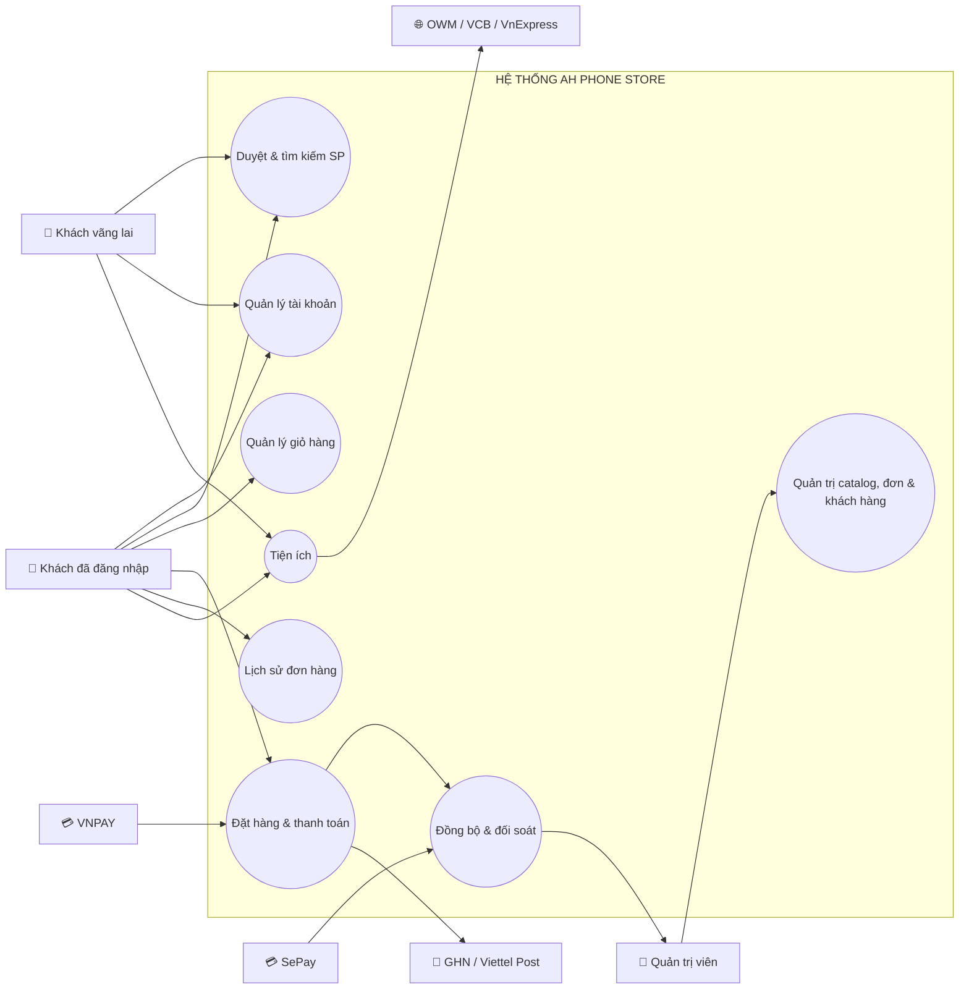
```mermaid
flowchart LR
    GUEST["👤 Khách vãng lai"]
    CUST["👤 Khách đã đăng nhập"]
    ADMIN["🔧 Quản trị viên"]
    SEPAY["💳 SePay"]
    VNPAY["💳 VNPAY"]
    SHIP["🚚 GHN / Viettel Post"]
    UTIL["🌐 OWM / VCB / VnExpress"]

    subgraph SYS["HỆ THỐNG AH PHONE STORE"]
        UC_BROWSE(("Duyệt & tìm kiếm SP"))
        UC_ACC(("Quản lý tài khoản"))
        UC_CART(("Quản lý giỏ hàng"))
        UC_ORDER(("Đặt hàng & thanh toán"))
        UC_HISTORY(("Lịch sử đơn hàng"))
        UC_UTIL(("Tiện ích"))
        UC_ADMIN(("Quản trị catalog, đơn & khách hàng"))
        UC_SYNC(("Đồng bộ & đối soát"))
    end

    GUEST --> UC_BROWSE
    GUEST --> UC_ACC
    GUEST --> UC_UTIL
    CUST --> UC_ACC
    CUST --> UC_BROWSE
    CUST --> UC_CART
    CUST --> UC_ORDER
    CUST --> UC_HISTORY
    CUST --> UC_UTIL
    ADMIN --> UC_ADMIN

    UC_ORDER --> UC_SYNC
    SEPAY --> UC_SYNC
    VNPAY --> UC_ORDER
    UC_ORDER --> SHIP
    UC_UTIL --> UTIL
    UC_SYNC --> ADMIN
```

### 2.3. Yêu cầu chức năng

| Mã | Nhóm | Yêu cầu chức năng |
|---|---|---|
| FR01 | Sản phẩm | Hiển thị danh sách sản phẩm theo danh mục/thương hiệu |
| FR02 | Sản phẩm | Hiển thị chi tiết sản phẩm (ảnh nhiều góc, thông số kỹ thuật, giá, tình trạng kho) |
| FR03 | Sản phẩm | Tìm kiếm sản phẩm theo tên, thương hiệu |
| FR04 | Sản phẩm | Lọc và sắp xếp sản phẩm theo giá, tên, vị trí |
| FR05 | Giỏ hàng | Thêm sản phẩm vào giỏ (kèm thông báo toast) |
| FR06 | Giỏ hàng | Cập nhật số lượng, xóa sản phẩm khỏi giỏ |
| FR07 | Đặt hàng | Đặt hàng với thông tin giao hàng và ghi chú |
| FR08 | Vận chuyển | Chọn địa chỉ Tỉnh/Quận/Phường và tính phí ship theo GHN / Viettel Post |
| FR09 | Thanh toán | Thanh toán khi nhận hàng (COD) |
| FR10 | Thanh toán | Thanh toán chuyển khoản với QR động, tự đối soát qua SePay |
| FR11 | Thanh toán | Thanh toán qua VNPAY (ATM/Visa/QR) với xác thực HMAC-SHA512 |
| FR12 | Thanh toán | Tự động xác nhận đơn và cập nhật trạng thái sau khi nhận tiền |
| FR13 | COD | Cho phép khách xác nhận "đã nhận hàng" để hoàn tất đơn COD |
| FR14 | Tài khoản | Đăng ký tài khoản với xác thực OTP qua email |
| FR15 | Tài khoản | Đăng nhập, đăng xuất |
| FR16 | Tài khoản | Xem hồ sơ, đổi mật khẩu |
| FR17 | Lịch sử | Xem lịch sử đơn hàng (đang chờ / đã thanh toán) |
| FR18 | Lịch sử | Mua lại sản phẩm đã mua |
| FR19 | Tiện ích | Hiển thị thời tiết (OpenWeatherMap) |
| FR20 | Tiện ích | Hiển thị tỷ giá ngoại tệ (Vietcombank) |
| FR21 | Tiện ích | Hiển thị tin tức kinh doanh (VnExpress RSS) |
| FR22 | Quản trị | Quản lý sản phẩm/danh mục qua Magento Admin |
| FR23 | Quản trị | Quản lý đơn hàng, tạo hóa đơn tự động |
| FR24 | Quản trị | Xem danh sách đơn hàng nội bộ |
| FR25 | Quản trị | Quản lý khách hàng (xem, tìm kiếm, chỉnh sửa, kích hoạt/khóa tài khoản) qua Magento Admin |

### 2.4. Yêu cầu phi chức năng

| Mã | Yêu cầu | Chỉ tiêu / Mô tả |
|---|---|---|
| NFR01 | Hiệu năng | Trang storefront tải nội dung chính < 3 giây; cache GraphQL proxy 10 phút |
| NFR02 | Tính khả dụng | Uptime ≥ 99%; container `restart: unless-stopped`; tự reindex sau reboot |
| NFR03 | Bảo mật | Toàn bộ qua HTTPS (Cloudflare); xác thực webhook SePay (API key + IP whitelist); verify HMAC-SHA512 cho VNPAY |
| NFR04 | Khả năng mở rộng | Đóng gói Docker, mỗi dịch vụ một container, dễ scale ngang |
| NFR05 | Dễ bảo trì | Kiến trúc headless tách biệt frontend/backend, code TypeScript có kiểu rõ ràng |
| NFR06 | Tương thích | Responsive trên desktop, tablet, mobile |
| NFR07 | Toàn vẹn dữ liệu | Đồng bộ Magento idempotent (không tạo đơn trùng); đối soát theo `payment_code` duy nhất |
| NFR08 | Trải nghiệm | Thanh toán chuyển khoản tự kiểm tra mỗi 3 giây, không cần khách bấm xác nhận |

### 2.5. Sơ đồ tổng quan kiến trúc hệ thống

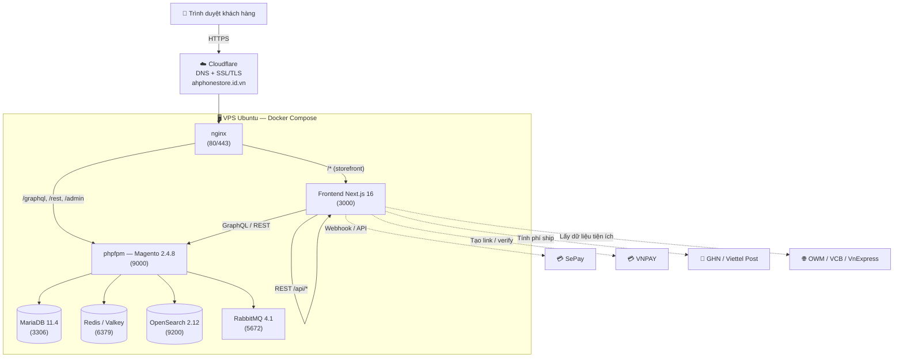
```mermaid
flowchart TD
    USER["👤 Trình duyệt khách hàng"]
    CF["☁️ Cloudflare<br/>DNS + SSL/TLS<br/>ahphonestore.id.vn"]

    subgraph VPS["🖥️ VPS Ubuntu — Docker Compose"]
        NGINX["nginx<br/>(80/443)"]
        FE["Frontend Next.js 16<br/>(3000)"]
        PHP["phpfpm — Magento 2.4.8<br/>(9000)"]
        DB[("MariaDB 11.4<br/>(3306)")]
        REDIS[("Redis / Valkey<br/>(6379)")]
        OS[("OpenSearch 2.12<br/>(9200)")]
        MQ["RabbitMQ 4.1<br/>(5672)"]
    end

    SEPAY["💳 SePay"]
    VNPAY["💳 VNPAY"]
    SHIP["🚚 GHN / Viettel Post"]
    EXT["🌐 OWM / VCB / VnExpress"]

    USER -->|HTTPS| CF --> NGINX
    NGINX -->|"/* (storefront)"| FE
    NGINX -->|"/graphql, /rest, /admin"| PHP
    FE -->|GraphQL / REST| PHP
    PHP --> DB
    PHP --> REDIS
    PHP --> OS
    PHP --> MQ
    FE -->|"REST /api/*"| FE
    FE -.->|Webhook / API| SEPAY
    FE -.->|Tạo link / verify| VNPAY
    FE -.->|Tính phí ship| SHIP
    FE -.->|Lấy dữ liệu tiện ích| EXT
```

---

## 3. PHÂN TÍCH NGHIỆP VỤ

### 3.1. Bảng quy tắc nghiệp vụ

| Mã | Quy tắc nghiệp vụ |
|---|---|
| BR01 | Mỗi sản phẩm thuộc ít nhất một danh mục; URL sản phẩm có dạng `/<thương-hiệu>/<tên-sản-phẩm>` và phải nhất quán với danh mục đang duyệt |
| BR02 | Khách phải đăng nhập trước khi vào trang thanh toán (checkout) |
| BR03 | Mật khẩu tối thiểu 8 ký tự, gồm chữ hoa, chữ thường và số |
| BR04 | Đăng ký tài khoản yêu cầu xác thực OTP gửi qua email; OTP có thời hạn và giới hạn số lần nhập sai |
| BR05 | Mỗi đơn hàng nội bộ có một `payment_code` (mã đối soát) duy nhất, dùng để khớp giao dịch chuyển khoản |
| BR06 | Đơn COD được tạo Magento order ngay khi đặt; đơn chuyển khoản/VNPAY chỉ tạo Magento order sau khi xác nhận đã nhận tiền |
| BR07 | Một đơn hàng chỉ được đồng bộ sang Magento **một lần** (idempotent theo `magento_order_number`) |
| BR08 | Giao dịch chuyển khoản chỉ được coi là hợp lệ khi: đúng tài khoản nhận, số tiền ≥ số tiền đơn, nội dung chứa `payment_code` |
| BR09 | Kết quả trả về từ VNPAY phải vượt qua kiểm tra chữ ký HMAC-SHA512 server-side mới được công nhận thanh toán thành công |
| BR10 | Phí vận chuyển được tính theo địa chỉ Tỉnh/Quận/Phường tại thời điểm đặt hàng (COD); không cho đặt khi chưa tính được phí |
| BR11 | Sau khi tạo hóa đơn (invoice), trạng thái đơn Magento chuyển từ `pending` → `processing` |
| BR12 | Sau khi thanh toán/đặt hàng thành công, giỏ hàng của sản phẩm tương ứng được xóa |
| BR13 | Lịch sử đơn hàng chỉ hiển thị 2 nhóm: "Đang chờ" và "Đã thanh toán"; không hiển thị đơn đã hủy |
| BR14 | Trạng thái thanh toán hợp lệ: `pending` → `paid` / `failed` / `cancelled` (không quay ngược từ `paid`) |
| BR15 | Mô tả sản phẩm hiển thị phải là tiếng Việt có dấu; nếu dữ liệu nguồn không có dấu thì dùng mô tả tự sinh có dấu |

### 3.2. Nghiệp vụ xử lý đặt hàng và thanh toán

Đây là nghiệp vụ trọng tâm của hệ thống, gồm 3 nhánh theo phương thức thanh toán.

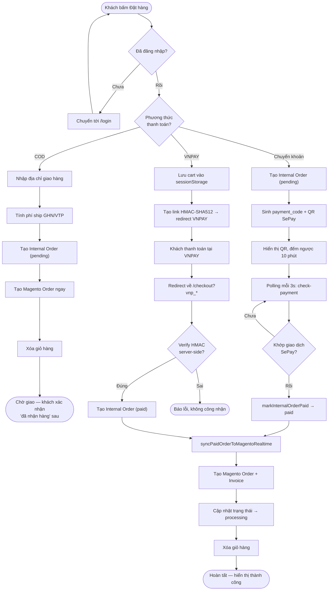
```mermaid
flowchart TD
    START(["Khách bấm Đặt hàng"]) --> CHECK{Đã đăng nhập?}
    CHECK -- Chưa --> LOGIN["Chuyển tới /login"] --> START
    CHECK -- Rồi --> METHOD{Phương thức<br/>thanh toán?}

    METHOD -- COD --> COD1["Nhập địa chỉ giao hàng"]
    COD1 --> COD2["Tính phí ship GHN/VTP"]
    COD2 --> COD3["Tạo Internal Order (pending)"]
    COD3 --> COD4["Tạo Magento Order ngay"]
    COD4 --> COD5["Xóa giỏ hàng"]
    COD5 --> CODEND(["Chờ giao — khách xác nhận<br/>'đã nhận hàng' sau"])

    METHOD -- "Chuyển khoản" --> BK1["Tạo Internal Order (pending)"]
    BK1 --> BK2["Sinh payment_code + QR SePay"]
    BK2 --> BK3["Hiển thị QR, đếm ngược 10 phút"]
    BK3 --> BK4["Polling mỗi 3s: check-payment"]
    BK4 --> BK5{Khớp giao dịch<br/>SePay?}
    BK5 -- Chưa --> BK4
    BK5 -- Rồi --> BK6["markInternalOrderPaid → paid"]
    BK6 --> SYNC

    METHOD -- VNPAY --> VN1["Lưu cart vào sessionStorage"]
    VN1 --> VN2["Tạo link HMAC-SHA512 → redirect VNPAY"]
    VN2 --> VN3["Khách thanh toán tại VNPAY"]
    VN3 --> VN4["Redirect về /checkout?vnp_*"]
    VN4 --> VN5{"Verify HMAC<br/>server-side?"}
    VN5 -- Sai --> VNERR(["Báo lỗi, không công nhận"])
    VN5 -- Đúng --> VN6["Tạo Internal Order (paid)"]
    VN6 --> SYNC

    SYNC["syncPaidOrderToMagentoRealtime"] --> SYNC1["Tạo Magento Order + Invoice"]
    SYNC1 --> SYNC2["Cập nhật trạng thái → processing"]
    SYNC2 --> SYNC3["Xóa giỏ hàng"]
    SYNC3 --> DONE(["Hoàn tất — hiển thị thành công"])
```

---

## 4. PHÂN TÍCH LUỒNG DỮ LIỆU DỰA VÀO DFD

### 4.1. DFD context (mức ngữ cảnh)

Sơ đồ ngữ cảnh xem toàn bộ hệ thống là **một tiến trình duy nhất (process 0)** và mô tả luồng dữ liệu giữa hệ thống với các tác nhân ngoài.

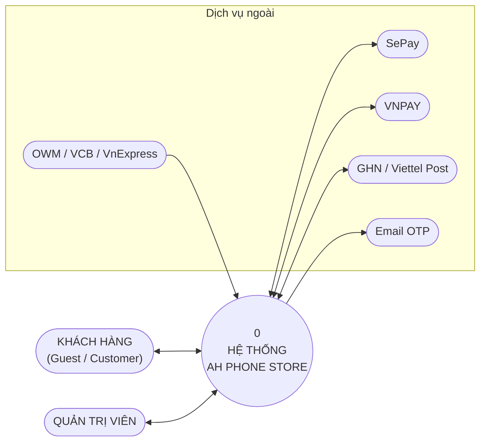
```mermaid
flowchart LR
    KH(["KHÁCH HÀNG<br/>(Guest / Customer)"])
    ADMIN(["QUẢN TRỊ VIÊN"])

    subgraph EXT["Dịch vụ ngoài"]
        SEPAY(["SePay"])
        VNPAY(["VNPAY"])
        SHIP(["GHN / Viettel Post"])
        UTIL(["OWM / VCB / VnExpress"])
        MAIL(["Email OTP"])
    end

    SYS(("0<br/>HỆ THỐNG<br/>AH PHONE STORE"))

    KH <--> SYS
    ADMIN <--> SYS
    SYS <--> SEPAY
    SYS <--> VNPAY
    SYS <--> SHIP
    SYS --> MAIL
    UTIL --> SYS
```

**Bảng luồng dữ liệu của DFD context:**

| Luồng | Nội dung dữ liệu |
|---|---|
| KH → Hệ thống | Đăng ký/đăng nhập/đổi mật khẩu, tìm kiếm & lọc SP, thao tác giỏ hàng, thông tin đặt hàng + địa chỉ, chọn PTTT, xác nhận đã nhận hàng (COD) |
| Hệ thống → KH | Danh sách & chi tiết SP, thông số kỹ thuật, giỏ hàng & tổng tiền, QR/link TT + TK nhận tiền, trạng thái & lịch sử đơn, token, OTP, thời tiết/tỷ giá/tin tức |
| ADMIN → Hệ thống | Quản lý SP/danh mục/giá/tồn kho, xử lý đơn & hóa đơn, quản lý khách hàng |
| Hệ thống → ADMIN | Danh sách đơn (Magento + nội bộ), thông tin SP/khách hàng, báo cáo |
| Hệ thống → VNPAY | Yêu cầu tạo link thanh toán (ký HMAC-SHA512) |
| VNPAY → Hệ thống | Kết quả thanh toán + vnp_SecureHash, IPN callback |
| SePay → Hệ thống | Webhook xác nhận giao dịch chuyển khoản |
| Hệ thống → SePay | Truy vấn danh sách giao dịch để đối soát |
| Hệ thống → GHN/VTP | Yêu cầu địa giới hành chính + tính phí ship |
| GHN/VTP → Hệ thống | Tỉnh/Quận/Phường, phí vận chuyển |
| Hệ thống → Email | Yêu cầu gửi email chứa OTP |
| OWM/VCB/VnExpress → Hệ thống | Thời tiết, tỷ giá, tin tức |

> **Ghi chú:** **Ngân hàng** không vẽ thành tác nhân riêng vì hệ thống không trao đổi dữ liệu trực tiếp với ngân hàng; ngân hàng báo biến động số dư cho **SePay**, và SePay là đầu mối gửi webhook/đối soát cho hệ thống. Trong DFD, các tác nhân ngoài **không nối trực tiếp với nhau** — mọi luồng đều đi vào/ra process 0.

### 4.2. DFD level 0

Phân rã tiến trình 0 thành các tiến trình chức năng chính, kèm các kho dữ liệu (data store).

**Kho dữ liệu:**

- **DS1 — Magento DB**: sản phẩm, danh mục, khách hàng, đơn hàng Magento, hóa đơn.
- **DS2 — Internal Orders DB**: đơn hàng nội bộ, trạng thái thanh toán, thông tin đối soát.
- **DS3 — Redis**: giỏ hàng, cache, OTP, session.

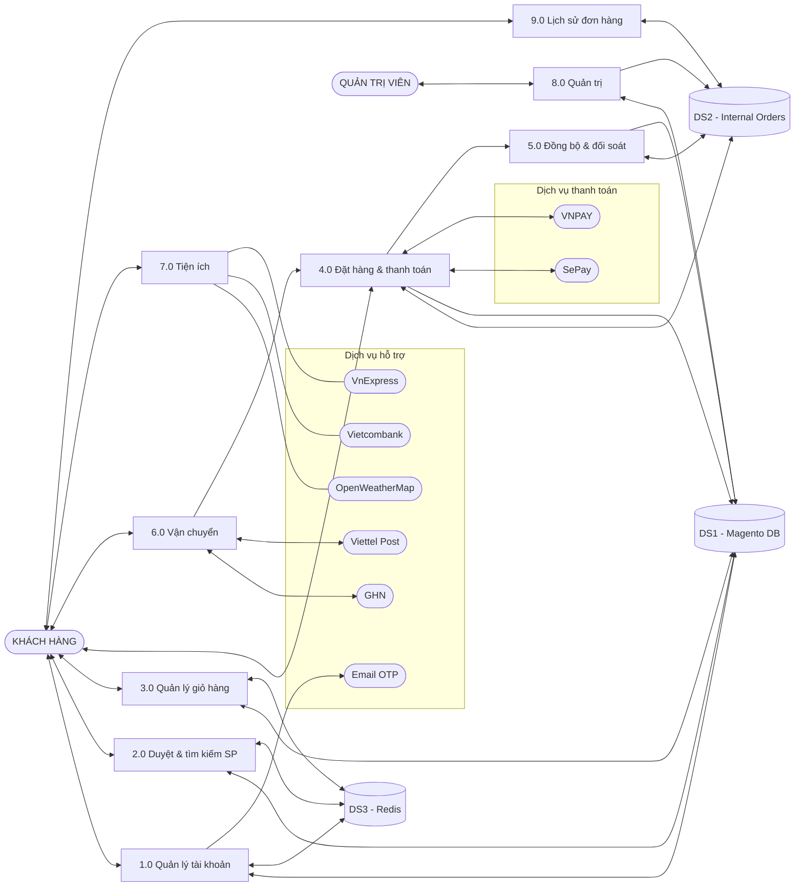
```mermaid
flowchart LR
    KH(["KHÁCH HÀNG"])
    ADMIN(["QUẢN TRỊ VIÊN"])
    subgraph EXT_PAY["Dịch vụ thanh toán"]
        SEPAY(["SePay"])
        VNPAY(["VNPAY"])
    end
    subgraph EXT_SVC["Dịch vụ hỗ trợ"]
        GHN(["GHN"])
        VTP(["Viettel Post"])
        OWM(["OpenWeatherMap"])
        VCB(["Vietcombank"])
        VNE(["VnExpress"])
        MAIL(["Email OTP"])
    end

    DS1[("DS1 - Magento DB")]
    DS2[("DS2 - Internal Orders")]
    DS3[("DS3 - Redis")]

    P1["1.0 Quản lý tài khoản"]
    P2["2.0 Duyệt & tìm kiếm SP"]
    P3["3.0 Quản lý giỏ hàng"]
    P4["4.0 Đặt hàng & thanh toán"]
    P5["5.0 Đồng bộ & đối soát"]
    P6["6.0 Vận chuyển"]
    P7["7.0 Tiện ích"]
    P8["8.0 Quản trị"]
    P9["9.0 Lịch sử đơn hàng"]

    %% ===== Khách hàng ↔ tiến trình =====
    KH <--> P1
    KH <--> P2
    KH <--> P3
    KH <--> P4
    KH <--> P6
    KH <--> P7
    KH <--> P9

    %% ===== Quản trị viên =====
    ADMIN <--> P8

    %% ===== Tiến trình ↔ kho dữ liệu =====
    P1 <--> DS1
    P1 <--> DS3
    P2 <--> DS1
    P2 <--> DS3
    P3 <--> DS1
    P3 <--> DS3
    P4 <--> DS2
    P4 --> DS1
    P5 <--> DS2
    P5 --> DS1
    P9 <--> DS2
    P8 <--> DS1
    P8 --> DS2

    %% ===== Tiến trình ↔ dịch vụ ngoài =====
    P1 --> MAIL
    P4 <--> SEPAY
    P4 <--> VNPAY
    P6 <--> GHN
    P6 <--> VTP
    P7 --- OWM
    P7 --- VCB
    P7 --- VNE

    %% ===== Liên kết nội bộ giữa tiến trình =====
    P6 --> P4
    P4 --> P5
```

> **Đọc sơ đồ:** Mũi tên hai chiều (↔) thể hiện luồng dữ liệu vào–ra giữa hai đối tượng; nhãn chi tiết của từng luồng được liệt kê trong bảng bên dưới (để sơ đồ gọn, không in nhãn trực tiếp lên các cạnh). Tiến trình **8.0 Quản trị** làm trung gian giữa Quản trị viên và kho dữ liệu (đúng nguyên tắc DFD: tác nhân không ghi trực tiếp vào kho dữ liệu). Đơn COD và đơn đã thanh toán đều đi qua **5.0** để đồng bộ Magento idempotent.

**Bảng mô tả luồng dữ liệu chính của DFD level 0:**

| Luồng | Nội dung dữ liệu |
|---|---|
| KH ↔ 1.0 | Vào: thông tin đăng ký/đăng nhập/đổi mật khẩu · Ra: token, OTP, kết quả |
| KH ↔ 2.0 | Vào: từ khóa, bộ lọc, chọn SP · Ra: danh sách, chi tiết, thông số kỹ thuật |
| KH ↔ 3.0 | Vào: thêm/sửa/xóa SP · Ra: giỏ hàng, tổng tiền, thông báo |
| KH ↔ 4.0 | Vào: thông tin đặt hàng, PTTT · Ra: QR/link TT, TK nhận tiền, trạng thái đơn |
| KH ↔ 6.0 | Vào: địa chỉ giao hàng · Ra: Tỉnh/Quận/Phường, phí ship |
| KH ↔ 7.0 | Vào: yêu cầu xem tiện ích · Ra: thời tiết, tỷ giá, tin tức |
| KH ↔ 9.0 | Vào: yêu cầu xem lịch sử, xác nhận đã nhận hàng (COD) · Ra: đơn đang chờ / đã thanh toán, kết quả xác nhận |
| ADMIN ↔ 8.0 | Vào: quản lý SP/danh mục/đơn/khách hàng · Ra: danh sách, báo cáo |
| 4.0 ↔ SePay | Vào: webhook giao dịch · Ra: truy vấn đối soát |
| 4.0 ↔ VNPAY | Vào: kết quả TT + SecureHash, IPN · Ra: yêu cầu tạo link (HMAC) |
| 6.0 ↔ GHN/VTP | Vào: địa giới HC, phí · Ra: yêu cầu tính phí |
| 1.0 → Email | Ra: yêu cầu gửi OTP |
| OWM/VCB/VnExpress → 7.0 | Vào: thời tiết, tỷ giá, tin tức |
| 6.0 → 4.0 | Phí ship đưa vào đơn hàng |
| 4.0 → 5.0 | Đơn COD/đã thanh toán → kích hoạt đồng bộ Magento |

### 4.3. DFD level 1

Mỗi tiến trình ở DFD level 0 được phân rã thành các tiến trình con. Dưới đây là DFD level 1 cho cả **9 tiến trình** (1.0 → 9.0).

#### 4.3.1. DFD level 1 — Quản lý tài khoản (phân rã tiến trình 1.0)

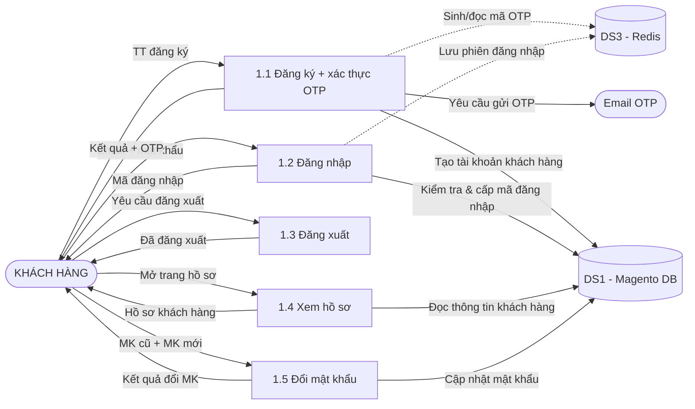
```mermaid
flowchart LR
    KH(["KHÁCH HÀNG"])
    MAIL(["Email OTP"])
    DS1[("DS1 - Magento DB")]
    DS3[("DS3 - Redis")]

    P11["1.1 Đăng ký + xác thực OTP"]
    P12["1.2 Đăng nhập"]
    P13["1.3 Đăng xuất"]
    P14["1.4 Xem hồ sơ"]
    P15["1.5 Đổi mật khẩu"]

    KH -->|"TT đăng ký"| P11
    KH -->|"Email + mật khẩu"| P12
    KH -->|"Yêu cầu đăng xuất"| P13
    KH -->|"Mở trang hồ sơ"| P14
    KH -->|"MK cũ + MK mới"| P15

    P11 -.->|"Sinh/đọc mã OTP"| DS3
    P11 -->|"Yêu cầu gửi OTP"| MAIL
    P11 -->|"Tạo tài khoản khách hàng"| DS1
    P12 -->|"Kiểm tra & cấp mã đăng nhập"| DS1
    P12 -.->|"Lưu phiên đăng nhập"| DS3
    P14 -->|"Đọc thông tin khách hàng"| DS1
    P15 -->|"Cập nhật mật khẩu"| DS1

    P11 -->|"Kết quả + OTP"| KH
    P12 -->|"Mã đăng nhập"| KH
    P13 -->|"Đã đăng xuất"| KH
    P14 -->|"Hồ sơ khách hàng"| KH
    P15 -->|"Kết quả đổi MK"| KH
```

#### 4.3.2. DFD level 1 — Duyệt & tìm kiếm sản phẩm (phân rã tiến trình 2.0)

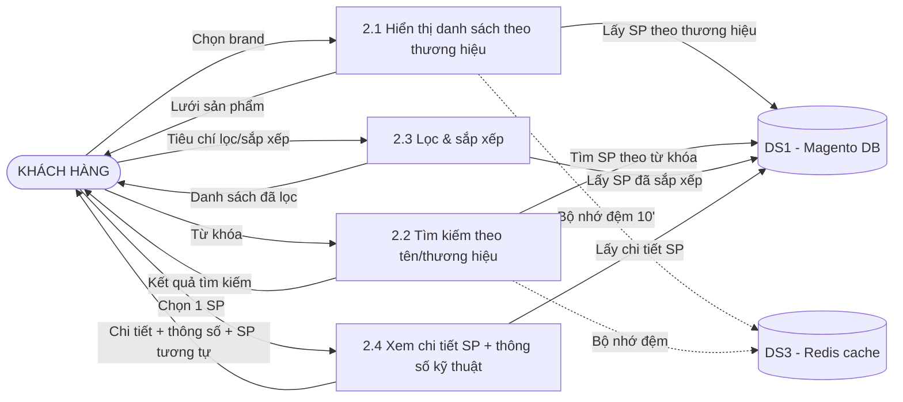
```mermaid
flowchart LR
    KH(["KHÁCH HÀNG"])
    DS1[("DS1 - Magento DB")]
    DS3[("DS3 - Redis cache")]

    P21["2.1 Hiển thị danh sách theo thương hiệu"]
    P22["2.2 Tìm kiếm theo tên/thương hiệu"]
    P23["2.3 Lọc & sắp xếp"]
    P24["2.4 Xem chi tiết SP + thông số kỹ thuật"]

    KH -->|"Chọn brand"| P21
    KH -->|"Từ khóa"| P22
    KH -->|"Tiêu chí lọc/sắp xếp"| P23
    KH -->|"Chọn 1 SP"| P24

    P21 -->|"Lấy SP theo thương hiệu"| DS1
    P22 -->|"Tìm SP theo từ khóa"| DS1
    P23 -->|"Lấy SP đã sắp xếp"| DS1
    P24 -->|"Lấy chi tiết SP"| DS1

    P21 -.->|"Bộ nhớ đệm 10'"| DS3
    P22 -.->|"Bộ nhớ đệm"| DS3

    P21 -->|"Lưới sản phẩm"| KH
    P22 -->|"Kết quả tìm kiếm"| KH
    P23 -->|"Danh sách đã lọc"| KH
    P24 -->|"Chi tiết + thông số + SP tương tự"| KH
```

#### 4.3.3. DFD level 1 — Quản lý giỏ hàng (phân rã tiến trình 3.0)

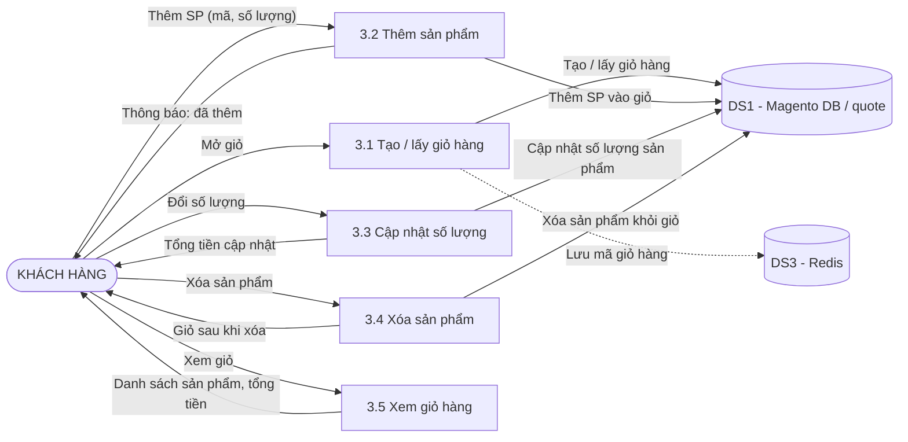
```mermaid
flowchart LR
    KH(["KHÁCH HÀNG"])
    DS1[("DS1 - Magento DB / quote")]
    DS3[("DS3 - Redis")]

    P31["3.1 Tạo / lấy giỏ hàng"]
    P32["3.2 Thêm sản phẩm"]
    P33["3.3 Cập nhật số lượng"]
    P34["3.4 Xóa sản phẩm"]
    P35["3.5 Xem giỏ hàng"]

    KH -->|"Mở giỏ"| P31
    KH -->|"Thêm SP (mã, số lượng)"| P32
    KH -->|"Đổi số lượng"| P33
    KH -->|"Xóa sản phẩm"| P34
    KH -->|"Xem giỏ"| P35

    P31 -->|"Tạo / lấy giỏ hàng"| DS1
    P32 -->|"Thêm SP vào giỏ"| DS1
    P33 -->|"Cập nhật số lượng sản phẩm"| DS1
    P34 -->|"Xóa sản phẩm khỏi giỏ"| DS1
    P31 -.->|"Lưu mã giỏ hàng"| DS3

    P32 -->|"Thông báo: đã thêm"| KH
    P33 -->|"Tổng tiền cập nhật"| KH
    P34 -->|"Giỏ sau khi xóa"| KH
    P35 -->|"Danh sách sản phẩm, tổng tiền"| KH
```

#### 4.3.4. DFD level 1 — Xử lý đặt hàng & thanh toán (phân rã tiến trình 4.0)

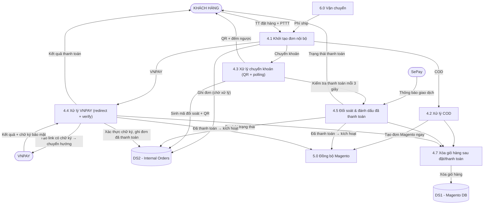
```mermaid
flowchart TD
    KH(["KHÁCH HÀNG"])
    SEPAY(["SePay"])
    VNPAY(["VNPAY"])
    P6EXT["6.0 Vận chuyển"]
    DS1[("DS1 - Magento DB")]
    DS2[("DS2 - Internal Orders")]
    P5EXT["5.0 Đồng bộ Magento"]

    P41["4.1 Khởi tạo đơn nội bộ"]
    P42["4.2 Xử lý COD"]
    P43["4.3 Xử lý chuyển khoản (QR + polling)"]
    P44["4.4 Xử lý VNPAY (redirect + verify)"]
    P45["4.5 Đối soát & đánh dấu đã thanh toán"]
    P47["4.7 Xóa giỏ hàng sau đặt/thanh toán"]

    P6EXT -->|"Phí ship"| P41
    KH -->|"TT đặt hàng + PTTT"| P41
    P41 -->|"Ghi đơn (chờ xử lý)"| DS2

    P41 -->|"COD"| P42
    P42 -->|"Tạo đơn Magento ngay"| P5EXT
    P42 --> P47

    P41 -->|"Chuyển khoản"| P43
    P43 -->|"Sinh mã đối soát + QR"| DS2
    P43 -->|"QR + đếm ngược"| KH
    SEPAY -->|"Thông báo giao dịch"| P45
    P43 -->|"Kiểm tra thanh toán mỗi 3 giây"| P45
    P45 -->|"Đọc/ghi trạng thái"| DS2
    P45 -->|"Đã thanh toán → kích hoạt"| P5EXT
    P45 --> P47

    P41 -->|"VNPAY"| P44
    P44 -->|"Tạo link có chữ ký → chuyển hướng"| VNPAY
    VNPAY -->|"Kết quả + chữ ký bảo mật"| P44
    P44 -->|"Xác thực chữ ký, ghi đơn đã thanh toán"| DS2
    P44 -->|"Đã thanh toán → kích hoạt"| P5EXT
    P44 --> P47

    P47 -->|"Xóa giỏ hàng"| DS1

    P45 -->|"Trạng thái thanh toán"| KH
    P44 -->|"Kết quả thanh toán"| KH
```

> **Lưu ý:** Việc khách xác nhận "đã nhận hàng" đối với đơn COD được mô tả ở tiến trình **9.3** (thuộc 9.0 Lịch sử đơn hàng), vì thao tác này nằm ở trang tài khoản/lịch sử đơn.

#### 4.3.5. DFD level 1 — Đồng bộ & đối soát Magento (phân rã tiến trình 5.0)

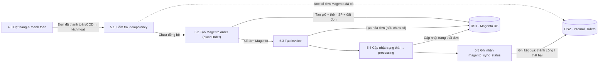
```mermaid
flowchart LR
    P4EXT["4.0 Đặt hàng & thanh toán"]
    DS1[("DS1 - Magento DB")]
    DS2[("DS2 - Internal Orders")]

    P51["5.1 Kiểm tra idempotency"]
    P52["5.2 Tạo Magento order (placeOrder)"]
    P53["5.3 Tạo invoice"]
    P54["5.4 Cập nhật trạng thái → processing"]
    P55["5.5 Ghi nhận magento_sync_status"]

    P4EXT -->|"Đơn đã thanh toán/COD → kích hoạt"| P51
    P51 -.->|"Đọc số đơn Magento đã có"| DS2
    P51 -->|"Chưa đồng bộ"| P52
    P52 -->|"Tạo giỏ + thêm SP + đặt đơn"| DS1
    P52 -->|"Số đơn Magento"| P53
    P53 -->|"Tạo hóa đơn (nếu chưa có)"| DS1
    P53 --> P54
    P54 -->|"Cập nhật trạng thái đơn"| DS1
    P54 --> P55
    P55 -->|"Ghi kết quả: thành công / thất bại"| DS2
```

#### 4.3.6. DFD level 1 — Quản lý vận chuyển (phân rã tiến trình 6.0)

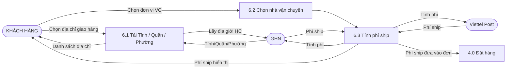
```mermaid
flowchart LR
    KH(["KHÁCH HÀNG"])
    GHN(["GHN"])
    VTP(["Viettel Post"])
    P4EXT["4.0 Đặt hàng"]

    P61["6.1 Tải Tỉnh / Quận / Phường"]
    P62["6.2 Chọn nhà vận chuyển"]
    P63["6.3 Tính phí ship"]

    KH -->|"Chọn địa chỉ giao hàng"| P61
    P61 -->|"Lấy địa giới HC"| GHN
    GHN -->|"Tỉnh/Quận/Phường"| P61
    P61 -->|"Danh sách địa chỉ"| KH

    KH -->|"Chọn đơn vị VC"| P62
    P62 --> P63
    P63 -->|"Tính phí"| GHN
    P63 -->|"Tính phí"| VTP
    GHN -->|"Phí ship"| P63
    VTP -->|"Phí ship"| P63
    P63 -->|"Phí ship hiển thị"| KH
    P63 -->|"Phí ship đưa vào đơn"| P4EXT
```

#### 4.3.7. DFD level 1 — Hiển thị tiện ích (phân rã tiến trình 7.0)

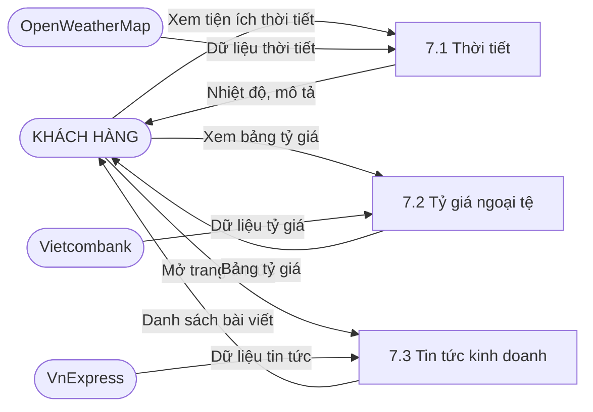
```mermaid
flowchart LR
    KH(["KHÁCH HÀNG"])
    OWM(["OpenWeatherMap"])
    VCB(["Vietcombank"])
    VNE(["VnExpress"])

    P71["7.1 Thời tiết"]
    P72["7.2 Tỷ giá ngoại tệ"]
    P73["7.3 Tin tức kinh doanh"]

    KH -->|"Xem tiện ích thời tiết"| P71
    KH -->|"Xem bảng tỷ giá"| P72
    KH -->|"Mở trang tin tức"| P73

    OWM -->|"Dữ liệu thời tiết"| P71
    VCB -->|"Dữ liệu tỷ giá"| P72
    VNE -->|"Dữ liệu tin tức"| P73

    P71 -->|"Nhiệt độ, mô tả"| KH
    P72 -->|"Bảng tỷ giá"| KH
    P73 -->|"Danh sách bài viết"| KH
```

#### 4.3.8. DFD level 1 — Quản trị (phân rã tiến trình 8.0)

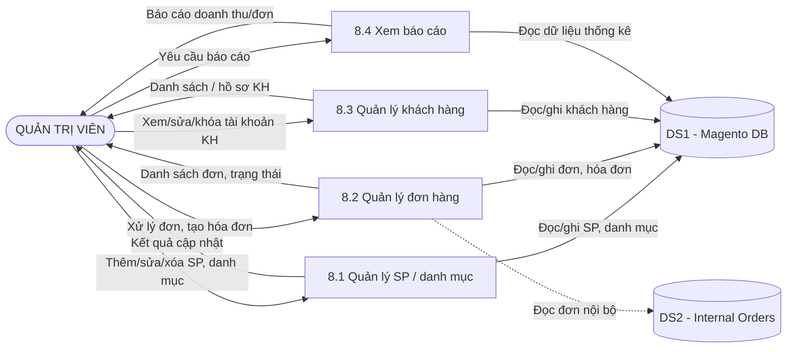
```mermaid
flowchart LR
    ADMIN(["QUẢN TRỊ VIÊN"])
    DS1[("DS1 - Magento DB")]
    DS2[("DS2 - Internal Orders")]

    P81["8.1 Quản lý SP / danh mục"]
    P82["8.2 Quản lý đơn hàng"]
    P83["8.3 Quản lý khách hàng"]
    P84["8.4 Xem báo cáo"]

    ADMIN -->|"Thêm/sửa/xóa SP, danh mục"| P81
    ADMIN -->|"Xử lý đơn, tạo hóa đơn"| P82
    ADMIN -->|"Xem/sửa/khóa tài khoản KH"| P83
    ADMIN -->|"Yêu cầu báo cáo"| P84

    P81 -->|"Đọc/ghi SP, danh mục"| DS1
    P82 -->|"Đọc/ghi đơn, hóa đơn"| DS1
    P82 -.->|"Đọc đơn nội bộ"| DS2
    P83 -->|"Đọc/ghi khách hàng"| DS1
    P84 -->|"Đọc dữ liệu thống kê"| DS1

    P81 -->|"Kết quả cập nhật"| ADMIN
    P82 -->|"Danh sách đơn, trạng thái"| ADMIN
    P83 -->|"Danh sách / hồ sơ KH"| ADMIN
    P84 -->|"Báo cáo doanh thu/đơn"| ADMIN
```

#### 4.3.9. DFD level 1 — Lịch sử đơn hàng (phân rã tiến trình 9.0)

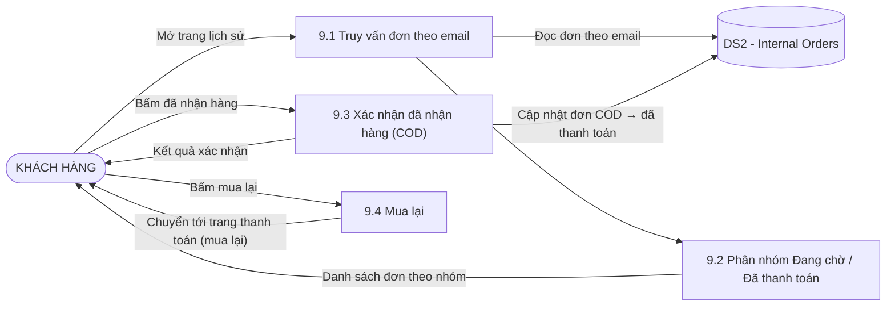
```mermaid
flowchart LR
    KH(["KHÁCH HÀNG"])
    DS2[("DS2 - Internal Orders")]

    P91["9.1 Truy vấn đơn theo email"]
    P92["9.2 Phân nhóm Đang chờ / Đã thanh toán"]
    P93["9.3 Xác nhận đã nhận hàng (COD)"]
    P94["9.4 Mua lại"]

    KH -->|"Mở trang lịch sử"| P91
    P91 -->|"Đọc đơn theo email"| DS2
    P91 --> P92
    P92 -->|"Danh sách đơn theo nhóm"| KH

    KH -->|"Bấm đã nhận hàng"| P93
    P93 -->|"Cập nhật đơn COD → đã thanh toán"| DS2
    P93 -->|"Kết quả xác nhận"| KH
    KH -->|"Bấm mua lại"| P94
    P94 -->|"Chuyển tới trang thanh toán (mua lại)"| KH
```

---


## 5. ĐẶC TẢ CƠ SỞ DỮ LIỆU

Hệ thống sử dụng **MariaDB 11.4** với hai nhóm dữ liệu:

- **Nhóm Magento** (do nền tảng quản lý): sản phẩm, danh mục, khách hàng, giỏ hàng (quote), đơn hàng, hóa đơn.
- **Nhóm nội bộ** (do storefront quản lý): đơn hàng nội bộ và item của đơn, phục vụ theo dõi thanh toán và đối soát; OTP đăng ký lưu ở Redis.

### 5.1. EERD tổng quan

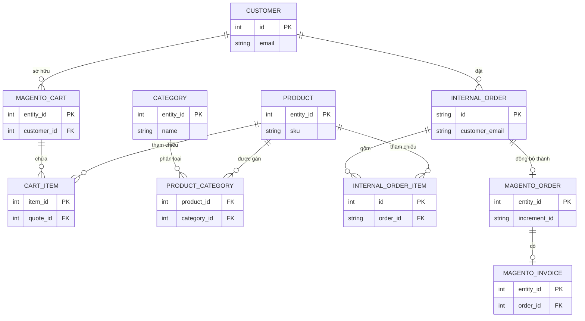
```mermaid
erDiagram
    CUSTOMER ||--o{ MAGENTO_CART : "sở hữu"
    MAGENTO_CART ||--o{ CART_ITEM : "chứa"
    CATEGORY ||--o{ PRODUCT_CATEGORY : "phân loại"
    PRODUCT ||--o{ PRODUCT_CATEGORY : "được gán"
    PRODUCT ||--o{ CART_ITEM : "tham chiếu"
    CUSTOMER ||--o{ INTERNAL_ORDER : "đặt"
    INTERNAL_ORDER ||--o{ INTERNAL_ORDER_ITEM : "gồm"
    INTERNAL_ORDER ||--o| MAGENTO_ORDER : "đồng bộ thành"
    MAGENTO_ORDER ||--o| MAGENTO_INVOICE : "có"
    PRODUCT ||--o{ INTERNAL_ORDER_ITEM : "tham chiếu"

    CUSTOMER {
        int id PK
        string email
    }
    PRODUCT {
        int entity_id PK
        string sku
    }
    CATEGORY {
        int entity_id PK
        string name
    }
    PRODUCT_CATEGORY {
        int product_id FK
        int category_id FK
    }
    MAGENTO_CART {
        int entity_id PK
        int customer_id FK
    }
    CART_ITEM {
        int item_id PK
        int quote_id FK
    }
    INTERNAL_ORDER {
        string id PK
        string customer_email
    }
    INTERNAL_ORDER_ITEM {
        int id PK
        string order_id FK
    }
    MAGENTO_ORDER {
        int entity_id PK
        string increment_id
    }
    MAGENTO_INVOICE {
        int entity_id PK
        int order_id FK
    }
```

### 5.2. Đặc tả các thực thể chính

#### CUSTOMER (Khách hàng)
| Thuộc tính | Kiểu | Mô tả |
|---|---|---|
| id (PK) | int | Mã khách hàng (Magento) |
| email | varchar(255) | Email đăng nhập, duy nhất |
| firstname / lastname | varchar | Họ và tên |
| password_hash | varchar | Mật khẩu đã băm |
| gender | tinyint | Giới tính (1 Nam, 2 Nữ, 3 không xác định) |
| date_of_birth | date | Ngày sinh |
| is_subscribed | tinyint | Đăng ký nhận tin |
| is_active | tinyint | Trạng thái kích hoạt |
| created_at | datetime | Ngày tạo tài khoản |

#### PRODUCT (Sản phẩm)
| Thuộc tính | Kiểu | Mô tả |
|---|---|---|
| entity_id (PK) | int | Mã sản phẩm |
| sku | varchar(128) | Mã SKU duy nhất |
| name | varchar(512) | Tên sản phẩm |
| price | decimal(12,2) | Giá niêm yết |
| special_price | decimal(12,2) | Giá khuyến mãi (nếu có) |
| status | int | Trạng thái hiển thị |
| stock_qty | decimal | Số lượng tồn kho |
| url_key | varchar | Slug URL |
| image | varchar | Ảnh đại diện |

#### CATEGORY (Danh mục)
| Thuộc tính | Kiểu | Mô tả |
|---|---|---|
| entity_id (PK) | int | Mã danh mục |
| name | varchar | Tên danh mục (Apple, Samsung, Tai nghe...) |
| url_key | varchar | Slug danh mục |
| parent_id | int | Danh mục cha |
| is_active | int | Trạng thái |

**Cây danh mục thực tế:** 8 thương hiệu điện thoại (Apple, Samsung, Xiaomi, Oppo, OnePlus, Vivo, Asus, Red Magic) + Tai nghe + Phụ kiện = **10 danh mục × 10 sản phẩm = 100 sản phẩm**.

#### INTERNAL_ORDER (Đơn hàng nội bộ)
| Thuộc tính | Kiểu | Mô tả |
|---|---|---|
| id (PK) | varchar(64) | Mã đơn nội bộ (ORD-XXXXXXXX) |
| payment_method | enum | cod / banking / vnpay |
| payment_code | varchar(32) | Mã đối soát duy nhất |
| status | enum | pending / paid / failed / cancelled |
| amount | bigint | Tổng tiền (VND) |
| currency | varchar(8) | Đơn vị tiền (mặc định VND) |
| customer_email | varchar(255) | Email khách đặt |
| note | text | Ghi chú đơn |
| bank_name / bank_account_no / qr_url | varchar/text | Thông tin chuyển khoản |
| sepay_transaction_id | varchar(128) | ID giao dịch SePay đã khớp |
| paid_at | bigint | Thời điểm thanh toán (epoch ms) |
| magento_order_number | varchar(64) | Số đơn Magento sau đồng bộ |
| magento_sync_status | enum | not_started / queued / success / failed |
| created_at / updated_at | bigint | Thời điểm tạo/cập nhật |

#### INTERNAL_ORDER_ITEM (Dòng sản phẩm trong đơn nội bộ)
| Thuộc tính | Kiểu | Mô tả |
|---|---|---|
| id (PK) | int | Khóa tự tăng |
| order_id (FK) | varchar(64) | Tham chiếu INTERNAL_ORDER.id |
| sku | varchar(128) | SKU sản phẩm |
| name | varchar(512) | Tên sản phẩm tại thời điểm mua |
| quantity | int | Số lượng |
| unit_price | decimal(12,2) | Đơn giá |
| row_total | decimal(12,2) | Thành tiền dòng |

#### MAGENTO_ORDER / MAGENTO_INVOICE
| Thực thể | Thuộc tính chính | Mô tả |
|---|---|---|
| MAGENTO_ORDER | entity_id (PK), increment_id, customer_email, status, state, grand_total, total_paid, created_at | Đơn hàng chính thức trong Magento |
| MAGENTO_INVOICE | entity_id (PK), order_id (FK), increment_id, state, grand_total, created_at | Hóa đơn gắn với đơn |

#### OTP_STORE (lưu tại Redis)
| Thuộc tính | Kiểu | Mô tả |
|---|---|---|
| email (key) | varchar | Email đăng ký |
| otp_code | varchar | Mã OTP |
| attempts | int | Số lần nhập sai |
| expires_at | bigint | Thời điểm hết hạn |

### 5.3. ERD đầy đủ thuộc tính đã chuẩn hóa

ERD dưới đây thể hiện đầy đủ thuộc tính sau khi chuẩn hóa về **3NF** (tách bảng N-N `PRODUCT_CATEGORY`, tách item ra khỏi đơn hàng).

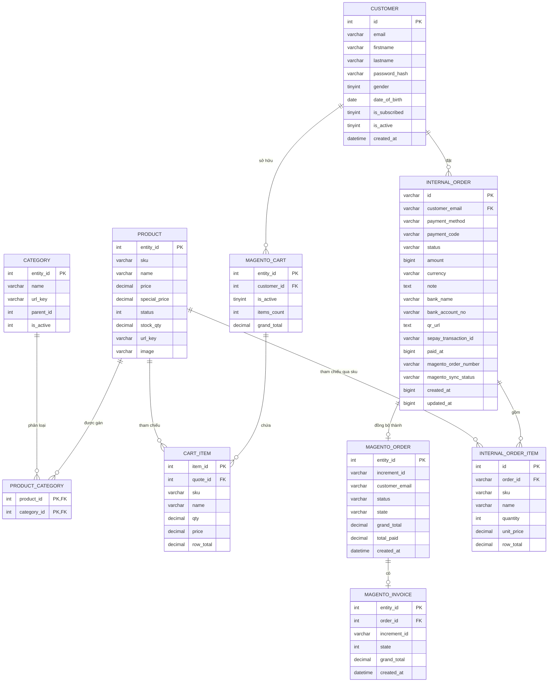
```mermaid
erDiagram
    CUSTOMER {
        int id PK
        varchar email
        varchar firstname
        varchar lastname
        varchar password_hash
        tinyint gender
        date date_of_birth
        tinyint is_subscribed
        tinyint is_active
        datetime created_at
    }

    PRODUCT {
        int entity_id PK
        varchar sku
        varchar name
        decimal price
        decimal special_price
        int status
        decimal stock_qty
        varchar url_key
        varchar image
    }

    CATEGORY {
        int entity_id PK
        varchar name
        varchar url_key
        int parent_id
        int is_active
    }

    PRODUCT_CATEGORY {
        int product_id PK,FK
        int category_id PK,FK
    }

    MAGENTO_CART {
        int entity_id PK
        int customer_id FK
        tinyint is_active
        int items_count
        decimal grand_total
    }

    CART_ITEM {
        int item_id PK
        int quote_id FK
        varchar sku
        varchar name
        decimal qty
        decimal price
        decimal row_total
    }

    MAGENTO_ORDER {
        int entity_id PK
        varchar increment_id
        varchar customer_email
        varchar status
        varchar state
        decimal grand_total
        decimal total_paid
        datetime created_at
    }

    MAGENTO_INVOICE {
        int entity_id PK
        int order_id FK
        varchar increment_id
        int state
        decimal grand_total
        datetime created_at
    }

    INTERNAL_ORDER {
        varchar id PK
        varchar customer_email FK
        varchar payment_method
        varchar payment_code
        varchar status
        bigint amount
        varchar currency
        text note
        varchar bank_name
        varchar bank_account_no
        text qr_url
        varchar sepay_transaction_id
        bigint paid_at
        varchar magento_order_number
        varchar magento_sync_status
        bigint created_at
        bigint updated_at
    }

    INTERNAL_ORDER_ITEM {
        int id PK
        varchar order_id FK
        varchar sku
        varchar name
        int quantity
        decimal unit_price
        decimal row_total
    }

    CUSTOMER ||--o{ MAGENTO_CART : "sở hữu"
    MAGENTO_CART ||--o{ CART_ITEM : "chứa"
    PRODUCT ||--o{ PRODUCT_CATEGORY : "được gán"
    CATEGORY ||--o{ PRODUCT_CATEGORY : "phân loại"
    PRODUCT ||--o{ CART_ITEM : "tham chiếu"
    CUSTOMER ||--o{ INTERNAL_ORDER : "đặt"
    INTERNAL_ORDER ||--o{ INTERNAL_ORDER_ITEM : "gồm"
    INTERNAL_ORDER ||--o| MAGENTO_ORDER : "đồng bộ thành"
    MAGENTO_ORDER ||--o| MAGENTO_INVOICE : "có"
    PRODUCT ||--o{ INTERNAL_ORDER_ITEM : "tham chiếu qua sku"
```

---

## 6. ĐẶC TẢ CHỨC NĂNG

### 6.1. Sơ đồ phân rã chức năng


```mermaid
flowchart TD
    ROOT["HỆ THỐNG AH PHONE STORE"]

    ROOT --> F1["1. Quản lý người dùng"]
    ROOT --> F2["2. Duyệt & tìm kiếm sản phẩm"]
    ROOT --> F3["3. Quản lý giỏ hàng"]
    ROOT --> F4["4. Đặt hàng & vận chuyển"]
    ROOT --> F5["5. Thanh toán & đối soát"]
    ROOT --> F6["6. Lịch sử đơn hàng"]
    ROOT --> F7["7. Tiện ích"]
    ROOT --> F8["8. Quản trị (Admin)"]

    F1 --> F1a["1.1 Đăng ký (OTP)"]
    F1 --> F1b["1.2 Đăng nhập"]
    F1 --> F1c["1.3 Đăng xuất"]
    F1 --> F1d["1.4 Quản lý hồ sơ / đổi mật khẩu"]

    F2 --> F2a["2.1 Danh sách theo brand"]
    F2 --> F2b["2.2 Tìm kiếm"]
    F2 --> F2c["2.3 Lọc & sắp xếp"]
    F2 --> F2d["2.4 Chi tiết + thông số KT"]

    F3 --> F3a["3.1 Thêm vào giỏ"]
    F3 --> F3b["3.2 Cập nhật số lượng"]
    F3 --> F3c["3.3 Xóa sản phẩm"]
    F3 --> F3d["3.4 Xem giỏ"]

    F4 --> F4a["4.1 Nhập địa chỉ giao hàng"]
    F4 --> F4b["4.2 Tính phí ship GHN/VTP"]
    F4 --> F4c["4.3 Xác nhận đặt hàng"]

    F5 --> F5a["5.1 Thanh toán COD"]
    F5 --> F5b["5.2 Chuyển khoản (SePay)"]
    F5 --> F5c["5.3 VNPAY"]
    F5 --> F5d["5.4 Đối soát & xác nhận"]
    F5 --> F5e["5.5 Đồng bộ Magento + invoice"]

    F6 --> F6a["6.1 Xem đơn đang chờ / đã TT"]
    F6 --> F6b["6.2 Xác nhận đã nhận hàng (COD)"]
    F6 --> F6c["6.3 Mua lại"]

    F7 --> F7a["7.1 Thời tiết"]
    F7 --> F7b["7.2 Tỷ giá"]
    F7 --> F7c["7.3 Tin tức"]

    F8 --> F8a["8.1 Quản lý SP / danh mục"]
    F8 --> F8b["8.2 Quản lý đơn hàng"]
    F8 --> F8c["8.3 Quản lý khách hàng"]
    F8 --> F8d["8.4 Xem báo cáo"]
```

### 6.2. Đặc tả chi tiết

> Mẫu đặc tả mỗi chức năng gồm: **Mục đích — Tác nhân — Tiền điều kiện — Luồng chính — Luồng phụ/ngoại lệ — Hậu điều kiện**.

#### 6.2.1. Quản lý người dùng

##### 6.2.1.1. Đăng ký (OTP)
- **Mục đích:** Tạo tài khoản khách hàng mới với xác thực email qua OTP.
- **Tác nhân:** Khách vãng lai.
- **Tiền điều kiện:** Email chưa được đăng ký.
- **Luồng chính:**
  1. Khách nhập họ tên, email, mật khẩu.
  2. Hệ thống gọi `POST /api/auth/register-otp` → sinh OTP, lưu Redis, gửi email.
  3. Khách nhập OTP nhận được.
  4. Hệ thống gọi `POST /api/auth/register-with-otp` → xác thực OTP → tạo customer qua `createCustomerV2` (Magento).
  5. Thông báo đăng ký thành công, chuyển hướng đăng nhập.
- **Ngoại lệ:** OTP sai/hết hạn (báo lỗi, cho nhập lại trong giới hạn lần thử — BR04); email đã tồn tại; mật khẩu không đủ mạnh (BR03).
- **Hậu điều kiện:** Tài khoản được tạo và kích hoạt.

##### 6.2.1.2. Đăng nhập
- **Mục đích:** Xác thực khách hàng và cấp token.
- **Tác nhân:** Khách đã có tài khoản.
- **Tiền điều kiện:** Tài khoản tồn tại và đang hoạt động.
- **Luồng chính:**
  1. Khách nhập email + mật khẩu.
  2. Hệ thống gọi `generateCustomerToken` (GraphQL).
  3. Lưu token vào client, cập nhật trạng thái đăng nhập.
- **Ngoại lệ:** Sai thông tin đăng nhập (báo lỗi); tài khoản bị khóa.
- **Hậu điều kiện:** Khách có token để truy cập chức năng yêu cầu xác thực.

##### 6.2.1.3. Đăng xuất
- **Mục đích:** Kết thúc phiên đăng nhập.
- **Tác nhân:** Khách đã đăng nhập.
- **Luồng chính:** Xóa token client, đặt lại trạng thái, chuyển về trang phù hợp.
- **Hậu điều kiện:** Không còn quyền truy cập chức năng yêu cầu đăng nhập.

##### 6.2.1.4. Quản lý hồ sơ / đổi mật khẩu
- **Mục đích:** Xem thông tin cá nhân và đổi mật khẩu.
- **Tác nhân:** Khách đã đăng nhập.
- **Tiền điều kiện:** Có token hợp lệ.
- **Luồng chính (đổi mật khẩu):**
  1. Khách nhập mật khẩu hiện tại, mật khẩu mới, xác nhận.
  2. Kiểm tra phía client: mật khẩu mới khớp xác nhận và ≥ 8 ký tự (BR03).
  3. Gọi mutation `changeCustomerPassword`.
  4. Thông báo kết quả.
- **Ngoại lệ:** Mật khẩu hiện tại sai; mật khẩu mới không khớp/không đủ mạnh.
- **Hậu điều kiện:** Mật khẩu được cập nhật.

#### 6.2.2. Duyệt & tìm kiếm sản phẩm

##### 6.2.2.1. Hiển thị danh sách theo thương hiệu
- **Mục đích:** Liệt kê sản phẩm theo danh mục/thương hiệu.
- **Tác nhân:** Mọi khách.
- **Luồng chính:** Lấy `category_id` theo brand → gọi `products(filter)` → render `ProductGrid` 12 SP/trang → mỗi `ProductCard` xây URL `/<brand>/<tên-sp>` (BR01).
- **Ngoại lệ:** Khi trả về 0 sản phẩm → thử lại tối đa 3 lần (3s/6s/9s), không cache kết quả rỗng (xem 7.3).
- **Hậu điều kiện:** Danh sách sản phẩm hiển thị.

##### 6.2.2.2. Tìm kiếm
- **Mục đích:** Tìm sản phẩm theo từ khóa.
- **Tác nhân:** Mọi khách.
- **Luồng chính:** Nhập từ khóa ở header → điều hướng `/?search=<từ khóa>` → gọi `SEARCH_PRODUCTS` → hiển thị kết quả.
- **Ngoại lệ:** Không có kết quả → hiển thị trạng thái rỗng.

##### 6.2.2.3. Lọc & sắp xếp
- **Mục đích:** Lọc theo brand và sắp xếp theo giá/tên/vị trí.
- **Luồng chính:** Chọn tiêu chí → cập nhật tham số truy vấn → gọi lại `products(sort)` → render.

##### 6.2.2.4. Chi tiết sản phẩm + thông số kỹ thuật
- **Mục đích:** Hiển thị đầy đủ thông tin một sản phẩm.
- **Tác nhân:** Mọi khách.
- **Luồng chính:**
  1. Truy vấn chi tiết theo `sku`/`url_key` (`GET_PRODUCT_DETAIL`).
  2. Hiển thị ảnh nhiều góc, giá, tình trạng kho.
  3. Mô tả: ưu tiên mô tả nguồn nếu là tiếng Việt có dấu, ngược lại dùng mô tả tự sinh có dấu (BR15).
  4. Hiển thị bảng thông số kỹ thuật của sản phẩm (theo dữ liệu cấu hình của hệ thống).
  5. Gợi ý sản phẩm tương tự cùng thương hiệu.
- **Ngoại lệ:** Không tìm thấy sản phẩm → trang 404/gợi ý.

#### 6.2.3. Quản lý giỏ hàng

##### 6.2.3.1. Thêm vào giỏ
- **Mục đích:** Thêm sản phẩm (kèm tùy chọn phiên bản nếu có) vào giỏ.
- **Tác nhân:** Khách hàng.
- **Tiền điều kiện:** Có/khởi tạo được cart.
- **Luồng chính:** Gọi `addProductsToCart(cartId, sku, qty)` → hiển thị toast "Đã thêm vào giỏ".
- **Ngoại lệ:** Hết hàng; lỗi mạng → thông báo lỗi.

##### 6.2.3.2. Cập nhật số lượng / 6.2.3.3. Xóa sản phẩm / 6.2.3.4. Xem giỏ
- **Mục đích:** Điều chỉnh nội dung giỏ và xem tổng tiền.
- **Luồng chính:** `updateCartItems` / `removeItemFromCart` → tính lại tổng → cập nhật giao diện.
- **Hậu điều kiện:** Giỏ hàng phản ánh đúng nội dung và tổng tiền.

#### 6.2.4. Đặt hàng & vận chuyển

##### 6.2.4.1. Nhập địa chỉ giao hàng (COD)
- **Mục đích:** Thu thập địa chỉ để tính phí và giao hàng.
- **Tác nhân:** Khách đã đăng nhập.
- **Luồng chính:** Tải Tỉnh → Quận/Huyện → Phường/Xã (GHN API) theo bậc; khách chọn lần lượt và nhập địa chỉ chi tiết.

##### 6.2.4.2. Tính phí vận chuyển
- **Mục đích:** Tính phí ship thực tế.
- **Luồng chính:** Gọi `POST /api/shipping/ghn` hoặc `/api/shipping/viettelpost` (action `calculate-fee`) với địa chỉ đích → nhận phí → cộng vào tổng đơn.
- **Ngoại lệ:** Không tính được phí → chặn đặt hàng (BR10).

##### 6.2.4.3. Xác nhận đặt hàng
- **Mục đích:** Khởi tạo đơn hàng nội bộ.
- **Tiền điều kiện:** Đã đăng nhập (BR02); đã chọn phương thức thanh toán; (với COD) địa chỉ hợp lệ và đã có phí ship.
- **Luồng chính:** Gọi `POST /api/orders/internal` → tạo Internal Order trạng thái `pending` → chuyển sang luồng thanh toán tương ứng.
- **Ngoại lệ:** Thiếu thông tin → cảnh báo; lỗi tạo đơn → báo lỗi.

#### 6.2.5. Thanh toán & đối soát

##### 6.2.5.1. Thanh toán COD
- **Mục đích:** Cho phép thanh toán khi nhận hàng.
- **Luồng chính:** Tạo Internal Order (pending) → tạo Magento order ngay (BR06) → xóa giỏ (BR12) → đơn nằm nhóm "Đang chờ" cho tới khi khách xác nhận đã nhận.
- **Hậu điều kiện:** Đơn COD tồn tại ở cả nội bộ và Magento.

##### 6.2.5.2. Thanh toán chuyển khoản (SePay)
- **Mục đích:** Thanh toán qua QR ngân hàng, đối soát tự động.
- **Luồng chính:**
  1. Tạo Internal Order (pending), sinh `payment_code` duy nhất (BR05) và QR SePay.
  2. Hiển thị QR + đếm ngược 10 phút.
  3. Polling `POST /api/orders/internal/:id/check-payment` mỗi 3 giây; song song nhận webhook SePay.
  4. Khi khớp giao dịch hợp lệ (BR08) → `markInternalOrderPaid` → trạng thái `paid` → kích hoạt đồng bộ Magento.
- **Ngoại lệ:** Hết thời gian chưa nhận tiền (đơn vẫn pending); số tiền/nội dung không khớp (bỏ qua giao dịch).
- **Hậu điều kiện:** Đơn `paid`, đã đồng bộ Magento.

##### 6.2.5.3. Thanh toán VNPAY
- **Mục đích:** Thanh toán qua cổng VNPAY.
- **Luồng chính:**
  1. Lưu dữ liệu giỏ vào `sessionStorage`.
  2. `POST /api/vnpay` tạo link ký HMAC-SHA512 → redirect sang VNPAY.
  3. Khách thanh toán → VNPAY redirect về `/checkout?vnp_*`.
  4. `POST /api/vnpay/verify` xác thực chữ ký server-side (BR09).
  5. Hợp lệ → tạo Internal Order trạng thái `paid` → đồng bộ Magento → xóa giỏ.
- **Ngoại lệ:** Chữ ký không hợp lệ → từ chối, ghi log IP; khách hủy giao dịch.
- **Hậu điều kiện:** Đơn `paid`, đã đồng bộ Magento.

##### 6.2.5.4. Đối soát & xác nhận
- **Mục đích:** Khớp giao dịch với đơn và đánh dấu đã thanh toán.
- **Luồng chính:** `findMatchingSePayTransaction` so khớp theo tài khoản nhận + số tiền + `payment_code` → cập nhật trạng thái; tuân thủ chuyển trạng thái hợp lệ (BR14).

##### 6.2.5.5. Đồng bộ Magento + invoice
- **Mục đích:** Tạo đơn chính thức và hóa đơn trong Magento.
- **Luồng chính:** Xem mục **7.2** (chi tiết idempotency).

#### 6.2.6. Lịch sử đơn hàng

##### 6.2.6.1. Xem đơn đang chờ / đã thanh toán
- **Mục đích:** Cho khách theo dõi đơn của mình.
- **Tác nhân:** Khách đã đăng nhập.
- **Luồng chính:** `GET /api/orders/internal?customerEmail=...&paidOnly=0` → lọc bỏ đơn test → chia 2 nhóm "Đang chờ" và "Đã thanh toán" (BR13) → mỗi thẻ hiển thị **tên sản phẩm in đậm trước**, thời gian, phương thức, trạng thái, tổng tiền; >5 đơn đã thanh toán có nút "Xem thêm".
- **Hậu điều kiện:** Danh sách đơn hiển thị đúng nhóm.

##### 6.2.6.2. Xác nhận đã nhận hàng (COD)
- **Mục đích:** Hoàn tất đơn COD từ phía khách.
- **Luồng chính:** Bấm "Tôi đã nhận được hàng" → `POST /api/orders/internal/:id/confirm-delivery` → cập nhật trạng thái `paid`.

##### 6.2.6.3. Mua lại
- **Mục đích:** Đặt lại nhanh sản phẩm đã mua.
- **Luồng chính:** Link `/checkout?sku=...&payment=banking&mode=single&buyAgain=1`.

#### 6.2.7. Tiện ích

| Mã | Chức năng | Nguồn | Endpoint |
|---|---|---|---|
| 7.1 | Thời tiết | OpenWeatherMap | `GET /api/weather` |
| 7.2 | Tỷ giá | Vietcombank (XML) | `GET /api/currency` |
| 7.3 | Tin tức | VnExpress RSS | `GET /api/news` |

- **Luồng chung:** Component gọi API route tương ứng → API route fetch nguồn ngoài → parse → trả dữ liệu đã chuẩn hóa → hiển thị (có cache hợp lý).

#### 6.2.8. Quản trị (Admin)

##### 6.2.8.1. Quản lý sản phẩm / danh mục
- **Tác nhân:** Admin (Magento Admin).
- **Luồng chính:** Đăng nhập admin → thêm/sửa/xóa sản phẩm, gán danh mục, cập nhật giá/tồn kho → reindex để storefront hiển thị.

##### 6.2.8.2. Quản lý đơn hàng
- **Luồng chính:** Xem danh sách đơn (Magento + trang `/admin/orders` nội bộ được bảo vệ bằng `INTERNAL_ORDERS_ADMIN_KEY`), theo dõi trạng thái, hóa đơn.

##### 6.2.8.3. Quản lý khách hàng
- **Tác nhân:** Admin (Magento Admin).
- **Mục đích:** Theo dõi và quản trị tài khoản khách hàng.
- **Luồng chính:** Xem danh sách khách hàng, tìm kiếm/lọc, xem chi tiết hồ sơ và lịch sử mua, chỉnh sửa thông tin, kích hoạt hoặc khóa tài khoản khi cần.

##### 6.2.8.4. Xem báo cáo
- **Luồng chính:** Dùng báo cáo doanh thu/đơn hàng sẵn có của Magento.

---

## 7. THIẾT KẾ XỬ LÝ CHO CÁC NGHIỆP VỤ TRỌNG TÂM

### 7.1. Xử lý thanh toán realtime và đối soát tự động

**Vấn đề:** Khi khách chuyển khoản, hệ thống phải tự nhận biết tiền về và xác nhận đơn mà không cần khách bấm nút, đồng thời tránh nhận nhầm giao dịch của đơn khác.

**Giải pháp — hai kênh song song:**

1. **Webhook (chủ động từ SePay):** SePay gọi `POST /api/sepay-webhook` mỗi khi có biến động số dư. Hệ thống xác thực `Authorization: Apikey <token>`, (tùy chọn) whitelist IP, rồi đối soát.
2. **Polling (chủ động từ client):** Trang checkout gọi `check-payment` mỗi **3 giây** để cập nhật trạng thái tức thì cho khách (hiển thị spinner "Hệ thống đang tự động kiểm tra thanh toán..." kèm link "Kiểm tra ngay").

**Thuật toán đối soát (BR08):**

```
function findMatchingSePayTransaction(order, transactions):
    for tx in transactions:
        if tx.accountNumber ∉ EXPECTED_ACCOUNTS:  continue   # đúng TK nhận
        if tx.amountIn < order.amount:             continue   # đủ tiền
        if order.payment_code ∉ tx.content:        continue   # đúng mã đối soát
        return tx                                             # → khớp
    return null
```

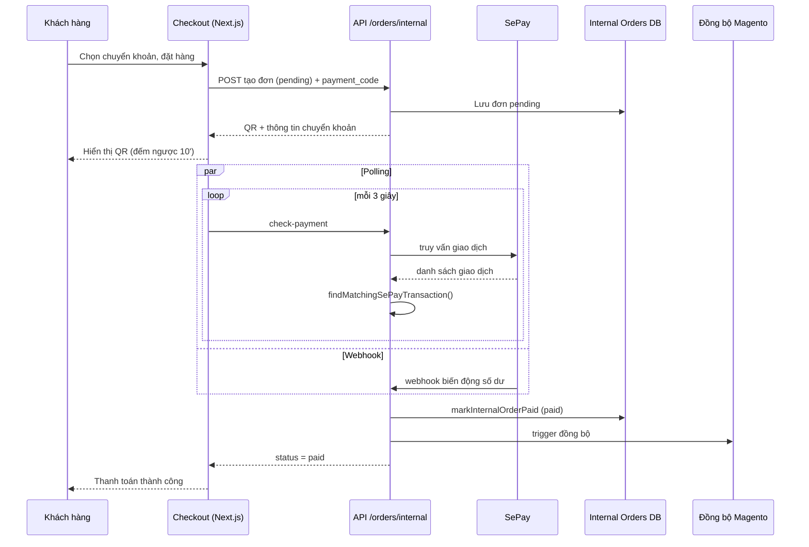
```mermaid
sequenceDiagram
    participant KH as Khách hàng
    participant FE as Checkout (Next.js)
    participant API as API /orders/internal
    participant SEPAY as SePay
    participant DB as Internal Orders DB
    participant SYNC as Đồng bộ Magento

    KH->>FE: Chọn chuyển khoản, đặt hàng
    FE->>API: POST tạo đơn (pending) + payment_code
    API->>DB: Lưu đơn pending
    API-->>FE: QR + thông tin chuyển khoản
    FE-->>KH: Hiển thị QR (đếm ngược 10')

    par Polling
        loop mỗi 3 giây
            FE->>API: check-payment
            API->>SEPAY: truy vấn giao dịch
            SEPAY-->>API: danh sách giao dịch
            API->>API: findMatchingSePayTransaction()
        end
    and Webhook
        SEPAY->>API: webhook biến động số dư
    end

    API->>DB: markInternalOrderPaid (paid)
    API->>SYNC: trigger đồng bộ
    API-->>FE: status = paid
    FE-->>KH: Thanh toán thành công
```

### 7.2. Xử lý đồng bộ đơn hàng và đảm bảo idempotency

**Vấn đề:** Webhook và polling có thể cùng phát hiện một giao dịch; nếu không kiểm soát sẽ tạo **đơn Magento trùng**.

**Giải pháp (BR07):** Trước khi tạo đơn Magento, kiểm tra `magento_order_number`. Chỉ tiến hành nếu chưa có; toàn bộ quy trình bọc trong kiểm tra trạng thái để đảm bảo chạy đúng một lần.

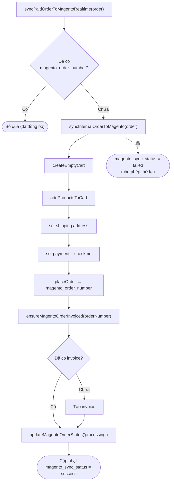
```mermaid
flowchart TD
    A["syncPaidOrderToMagentoRealtime(order)"] --> B{"Đã có<br/>magento_order_number?"}
    B -- Có --> Z(["Bỏ qua (đã đồng bộ)"])
    B -- Chưa --> C["syncInternalOrderToMagento(order)"]
    C --> C1["createEmptyCart"]
    C1 --> C2["addProductsToCart"]
    C2 --> C3["set shipping address"]
    C3 --> C4["set payment = checkmo"]
    C4 --> C5["placeOrder → magento_order_number"]
    C5 --> D["ensureMagentoOrderInvoiced(orderNumber)"]
    D --> D1{"Đã có invoice?"}
    D1 -- Có --> E
    D1 -- Chưa --> D2["Tạo invoice"]
    D2 --> E["updateMagentoOrderStatus('processing')"]
    E --> F(["Cập nhật magento_sync_status = success"])
    C -. lỗi .-> G(["magento_sync_status = failed<br/>(cho phép thử lại)"])
```

**Tính chất bảo đảm:**
- *Idempotent*: gọi lặp lại không tạo đơn/hóa đơn trùng.
- *Recoverable*: nếu lỗi giữa chừng, `magento_sync_status = failed` để job/thao tác sau thử lại.
- *Eventual consistency*: trạng thái nội bộ và Magento hội tụ về `paid`/`processing`.

### 7.3. Xử lý hiển thị sản phẩm ổn định sau gián đoạn

**Vấn đề:** Sau khi VPS hoặc OpenSearch khởi động lại, truy vấn đầu tiên có thể trả về 0 sản phẩm, gây trang trắng.

**Giải pháp nhiều lớp:**

1. **Hạ tầng:** OpenSearch đặt `restart: unless-stopped` + heap nhỏ (`-Xms256m -Xmx512m`) để khởi động nhanh; service systemd tự `reindex` sau reboot; cron `auto-reindex` mỗi 5 phút, `warm-cache` mỗi 10 phút.
2. **Chống cache rỗng:** Không cache kết quả `total_count = 0` ở cả GraphQL proxy lẫn trình duyệt → lần truy vấn sau luôn thử lại dữ liệu thật.
3. **Tự phục hồi phía client:** `loadProducts` thử lại tối đa 3 lần (3s/6s/9s) khi nhận 0 sản phẩm.
4. **Tăng cache hợp lệ:** TTL cache GraphQL proxy nâng lên 10 phút cho kết quả có dữ liệu, giảm tải backend.

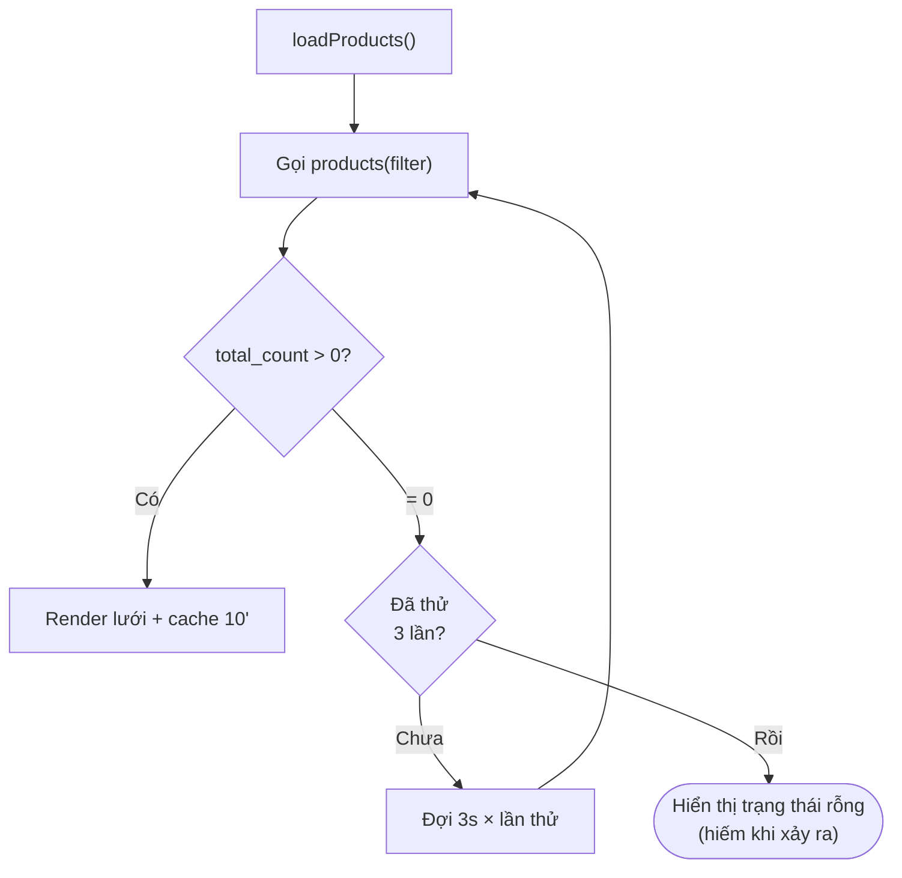
```mermaid
flowchart TD
    A["loadProducts()"] --> B["Gọi products(filter)"]
    B --> C{"total_count > 0?"}
    C -- Có --> D["Render lưới + cache 10'"]
    C -- "= 0" --> E{"Đã thử<br/>3 lần?"}
    E -- Chưa --> F["Đợi 3s × lần thử"] --> B
    E -- Rồi --> G(["Hiển thị trạng thái rỗng<br/>(hiếm khi xảy ra)"])
```

---

## 8. KẾT LUẬN

### 8.1. Tóm tắt

Tài liệu đã đặc tả nghiệp vụ và thiết kế cho **AH Phone Store** — hệ thống thương mại điện tử bán điện thoại và phụ kiện theo mô hình **Headless Commerce** (Magento 2 + Next.js 16). Nội dung bao phủ từ phân tích tác nhân, yêu cầu, quy tắc nghiệp vụ, mô hình luồng dữ liệu (DFD context → level 0 → level 1), thiết kế cơ sở dữ liệu (EERD → ERD chuẩn hóa 3NF), phân rã và đặc tả chi tiết chức năng, đến thiết kế xử lý cho các nghiệp vụ trọng tâm.

### 8.2. Điểm nổi bật của thiết kế

1. **Tự động hóa toàn trình thanh toán:** nhận tiền → đối soát → xác nhận → tạo order/invoice → cập nhật trạng thái, không cần thao tác tay.
2. **Đối soát hai kênh (webhook + polling):** vừa tin cậy vừa phản hồi tức thì cho khách.
3. **Đồng bộ idempotent:** không tạo đơn/hóa đơn trùng, có khả năng phục hồi khi lỗi.
4. **Bảo mật thanh toán:** xác thực webhook (API key + IP) và verify HMAC-SHA512 cho VNPAY ở server-side.
5. **Ổn định hiển thị sản phẩm:** nhiều lớp chống trang trắng sau gián đoạn hạ tầng.
6. **Trải nghiệm hiện đại:** giao diện đỏ chủ đạo, responsive, toast thông báo, URL thân thiện SEO.

### 8.3. Hướng phát triển

- Bổ sung đánh giá/nhận xét sản phẩm và gợi ý cá nhân hóa.
- Mở rộng phương thức thanh toán (ví điện tử khác) và đối tác vận chuyển.
- Thêm dashboard thống kê doanh thu trực quan ngoài báo cáo Magento mặc định.
- Áp dụng hàng đợi (RabbitMQ) cho đồng bộ Magento để tăng độ bền khi tải cao.

---

*Tài liệu được xây dựng dựa trên hệ thống thực tế đang vận hành tại https://ahphonestore.id.vn. Mục lục được điều chỉnh phù hợp với nghiệp vụ bán điện thoại (thay cho mẫu hệ thống đặt vé sự kiện).*
